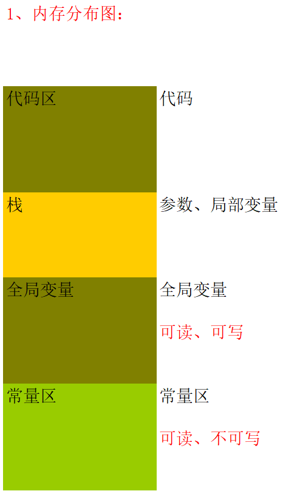

## 指针

### 字符数组与字符串

> 字符数组：`char arr[6] = {'A','B','C','D','E','F'};`
>
> 字符串：`char names[] = "ABCDE";`
>
> 注意：编译器后在后面添一个 00 做为字符串的结束标记。

#### 论证

```c

char arr[6] = {'A','B','C','D','E','\0'}; //也可以直接写 0 

char names[] = "ABCDE";

printf("%s\n",arr);

printf("%s\n",names);

//2种写法效果一样
```

## 常量



> 常量区中的字符串是不能够直接更改的

```c
char* x = "china";
char y[] = "china";
void Function()
{

	*(x+1) = 'A';	//不可修改

	 y[1] = 'A';	//可访问可修改
}
```

```c
void Function()
{
	char* x = "china";

	char y[] = "china";

	*(x+1) = 'A';	//不可修改

	y[1] = 'A';	//可访问不可修改
}

```

## 练习

> 查看Code.c
