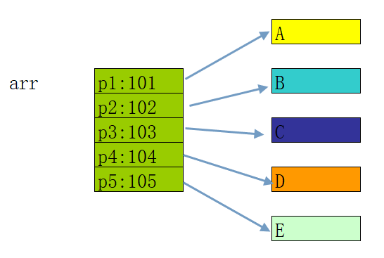

## 指针数组AND结构体数组

### 指针数组

```c
char* arr[5] = {0};	
	
arr[0] = (char*)1;	
arr[1] = (char*)2;	
arr[2] = (char*)3;	
arr[3] = (char*)4;	
arr[4] = (char*)5;	
	
	
char a1 = 'A';	
char a2 = 'B';	
char a3 = 'C';	
char a4 = 'D';	
char a5 = 'E';	
	
char* p1 = &a1;	
char* p2 = &a2;	
char* p3 = &a3;	
char* p4 = &a4;	
char* p5 = &a5;	
	
char* arr[5] = {p1,p2,p3,p4,p5};		
```



#### 遍历所有数组

```c
for(int i=0;i<5;i++)				
{				
	printf("%c\n",*(arr[i]));			
}				

```

#### 常用的指针数组

```c
				
char* p1 = "if";				
char* p2 = "for";				
char* p3 = "while";				
char* p4 = "switch";				
				
char* keyword[] = {p1,p2,p3,p4};				
				

```

```c
				
char* keyword[] = 				
{				
	if,			
	for,			
	while,			
	switch			
};				
				

```

### 结构体指针

```c
2、通过结构体指针读取、修改：

//创建结构体
Student s;
s.a = 10;
s.b = 20;
s.c = 30;

//声明结构体指针
Student* ps;

//为结构体指针赋值
ps = &s;

//通过指针读取数据
printf("%d\n",ps->a);

//通过指针修改数据
ps->a = 100;

printf("%d\n",ps->a);

```

> 详情见Code.c
