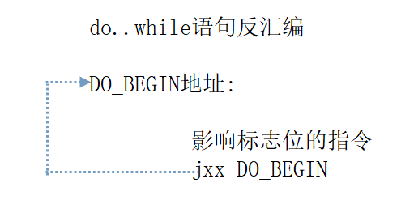

## 变量声明

    //全局变量的声明					    void Fun()
	int a,b,c;    //全局变量的声明			{
	void Fun()						int a,b,c;  //局部变量的声明
	{						               	a = 10;     //局部变量的赋值
		a = 10; //全局变量的赋值			b = 20;
		b = 20;					        c = a;
		c = a;				               }
	}

    总结：

    声明变量就是告诉计算机，我要用一块内存，你给我留着，宽度和存储格式有数据类型决定.

    计算机什么时候把这块内存给你，取决于变量的作用范围，如果是全局变量，在程序编译完就已经分配了空间，如果是局部变量，只有					
		所在的程序被调用的时候，才会分配空间.

    全局变量如果不赋初始值，默认是0，但局部变量在使用前一定要赋初值.

## 类型转换

> MOVSX 先符号扩展,再传送.

    MOV AL,0FF	
	MOVSX CX,AL	
	MOV AL,80	
	MOVSX CX,AL

> MOVZX 先零扩展,再传送.

    MOV AL,0FF	
	MOVZX CX,AL	
	MOV AL,80	
	MOVSX CX,AL

> 实例代码：

    //有符号小转大					
	void Function1()					
	{					
		char ci = 0xFF;

    short si = ci;

    int ni = ci;				
	}					
	//无符号小转大					
	void Function2()					
	{					
		unsigned char ci = 0xFF;

    unsigned short si = ci;

    unsigned int ni = ci;				
	}

> 实例代码：

    void Function1()					
	{					
		int ni = 0x12345678;

    short si = ni;

    char ci = ni;				
	}

> 什么是表达式？表达式的结果.

    特点一：

    表达式无论多么复杂，都只有一个结果

    特点二：

    只有表达式，可以编译通过，但并不生成代码，需要与赋值或者其他流程控制语句一起组合的时候才有意义.

    特点三：当表达式中存在不同宽度的变量时，结果将转换为宽度最大的那个.

    char a;					
		int b;

    a = 10;					
		b = 20;

    printf("%d",a+b);

    特点四：当表达式中同时存在有符号和无符号数的时候，表达式的结构将转换为无符号数.

    unsigned char a;					
		char b;

    a = 0xFE;					
		b = 1;

    printf("%d",a+b);

    3、什么是语句？什么是程序块？

    声明语句

    赋值语句

    流程控制语句IF...ELSE...是个整体

    什么是程序块？为什么要有程序块？

    4、什么时候需要用到参数？

    比如：能够计算任意两个整数的和

    5、什么时候需要用到返回值？

    没有返回值的函数的反汇编

    有返回值的函数的反汇编

    如何使用函数的返回值

    代码演示：编写一个函数，能够得到任意5个整数的和，并返回结果.

> 6、关系运算符：“==”、“!=”、“>=”、“<=”、“>”、“<”

> 7、逻辑运算符：&& || !

    void Fun(int x,int y,int z)					void Fun(int x,int y,int z)	
	{					{	
		if(x>1 && y>1 && z>1)					if(x>1 || y>1 || z>1)
		{					{
			printf("OK");					    printf("OK");
		}					}
		else					                else
		{					{
			printf("Error");					printf("Error");
		}					}
	}					}

> 8、单目运算符

    void Fun(int x,int y,int z)					void Fun(int x,int y,int z)	
	{					{
    int i = 10;					            int i = 10;

    int k = ++i;					        int k = i++;

    printf("%d-%d\n",i,k);					printf("%d-%d\n",i,k);
	}					}

> 9、三目运算符

    void Fun(int x,int y)						
	{						
		int r = x>y?x:y;

    printf("%d\n",r);					
	}

> 10、语句的执行条件

    void Fun(int x,int y)					
	{					
		if(1)				
		{				
			printf("1\n");			
		}				
		if(2)				
		{				
			printf("2\n");			
		}				
		if(-1)				
		{				
			printf("3\n");			
		}				
		if(0)				
		{				
			printf("4\n");			
		}				
		if(x>y)				
		{				
			printf("5\n");			
		}				
		if(x=2)				
		{				
			printf("6\n");			
		}				
		if(x==2)				
		{				
			printf("7\n");			
		}				
	}

## 基本循环条件

> Do...While循环

```c
do{
	//执行代码
}while(表达式)
```

> Do..while语句反汇编


